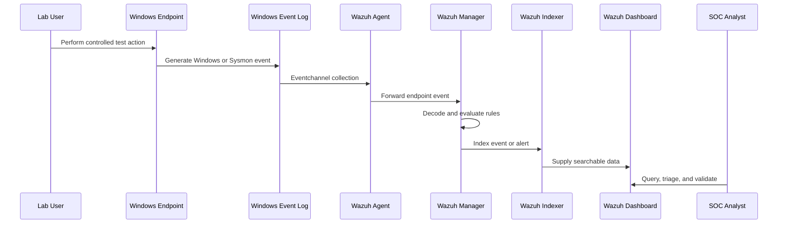

# Security Data Flow

## General event-to-alert flow

1. A user or process performs an action on the Windows endpoint.
2. Windows or Sysmon writes an event to a Windows Event Log channel.
3. The Wazuh agent reads configured channels from `ossec.conf`.
4. The agent forwards the event to the Wazuh manager.
5. Wazuh decoders extract fields such as event ID, image, command line, and target filename.
6. Built-in and custom rules evaluate the decoded event.
7. A matching alert is sent to the Wazuh indexer.
8. The Wazuh Dashboard makes the evidence searchable for analyst triage.
9. The analyst validates context and documents the result.



## Sysmon Event ID 11: FileCreate

```text
PowerShell creates C:\SOC-Lab\sysmon-file-test.txt
  -> Sysmon observes file creation
  -> Event ID 11 is written to Microsoft-Windows-Sysmon/Operational
  -> Wazuh agent collects the channel
  -> Wazuh decodes TargetFilename, Image, ProcessId, and UtcTime
  -> Built-in or custom rule evaluates the path
  -> Analyst reviews the event or alert in the Dashboard
```

Event ID `11` proves that Sysmon observed file creation. It does not prove file-content integrity or subsequent modification by itself.

## Wazuh FIM: added, modified, and deleted

```text
Wazuh syscheck establishes a baseline for C:\SOC-Lab
  -> A file is added
  -> Its content or metadata is modified
  -> The file is deleted
  -> The Wazuh agent compares each state with the baseline
  -> Wazuh generates FIM events and rules 554, 550, and 553
  -> Analyst reviews syscheck.path, syscheck.event, hashes, and rule metadata
```

FIM and Sysmon can observe related file activity, but they answer different questions:

| Source | Primary question |
|---|---|
| Sysmon Event ID 11 | Which process created this file, and when? |
| Wazuh FIM | Did a monitored file or directory change relative to its baseline? |

## Interpretation checkpoints

- **Generated:** the endpoint wrote the event.
- **Collected:** Wazuh received and indexed the event.
- **Alerted:** a Wazuh rule matched at an alerting level.
- **Custom detected:** a project-specific rule ID matched.

