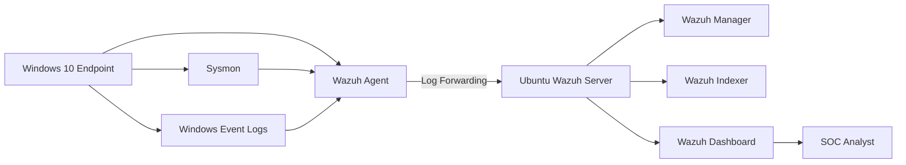

#  Architecture

## Project Name

Mini project with Wazuh and Sysmon

## Objective

The objective of this lab is to build a small SOC environment that can collect endpoint logs, forward them to a centralized SIEM platform, detect suspicious behavior, and support alert investigation.

## Lab Scope

This lab focuses on the following areas:

- Wazuh SIEM deployment
- Windows endpoint monitoring
- Wazuh Agent onboarding
- Sysmon telemetry collection
- Windows security event collection
- Custom detection rules
- MITRE ATT&CK mapping
- Alert triage and incident documentation

## Diagram

The final lab architecture will include a Windows endpoint connected to the Wazuh server through the Wazuh Agent.

```text
+----------------------------+
|      Windows 10 Endpoint   |
|                            |
|  Wazuh Agent               |
|  Sysmon                    |
|  Windows Event Logs        |
+-------------+--------------+
              |
              | Log forwarding
              |
+-------------v--------------+
|      Ubuntu Wazuh Server   |
|                            |
|  Wazuh Manager             |
|  Wazuh Indexer             |
|  Wazuh Dashboard           |
+-------------+--------------+
              |
              | Web UI
              |
+-------------v--------------+
|      SOC Analyst           |
|                            |
|  Alert Review              |
|  Detection Validation      |
|  Incident Report           |
+----------------------------+
```
# Network Diagram

The final lab will include a Windows endpoint with Wazuh Agent and Sysmon forwarding logs to the Wazuh server.



## Components

| Component | Role |
|---|---|
| Ubuntu Wazuh Server | Central SIEM platform |
| Wazuh Manager | Receives and processes logs from agents |
| Wazuh Indexer | Stores and indexes security data |
| Wazuh Dashboard | Provides web interface for monitoring and investigation |
| Windows 10 Endpoint | Monitored client machine |
| Wazuh Agent | Sends endpoint logs to the Wazuh Manager |
| Sysmon | Provides detailed Windows endpoint telemetry |
| SOC Analyst | Reviews alerts and performs investigation |


# Data Flow


After all phases are completed, endpoint telemetry will flow from the Windows endpoint to the Wazuh server.

```text
User activity on Windows endpoint
    ↓
Windows Event Logs / Sysmon Logs
    ↓
Wazuh Agent
    ↓
Wazuh Manager
    ↓
Wazuh Indexer
    ↓
Wazuh Dashboard
    ↓
SOC Analyst investigation
```

## Detailed Log Flow

| Step | Source | Destination | Description |
|---|---|---|---|
| 1 | Windows Endpoint | Windows Event Logs / Sysmon | Endpoint activity generates logs |
| 2 | Windows Logs | Wazuh Agent | Agent reads configured log sources |
| 3 | Wazuh Agent | Wazuh Manager | Logs are forwarded to the SIEM |
| 4 | Wazuh Manager | Wazuh Ruleset | Events are decoded and matched with rules |
| 5 | Wazuh Manager | Wazuh Indexer | Alerts and events are indexed |
| 6 | Wazuh Indexer | Wazuh Dashboard | Data is displayed for analysis |
| 7 | Wazuh Dashboard | SOC Analyst | Analyst reviews alerts and investigates |

## Planned Log Sources

| Log Source | Purpose |
|---|---|
| Windows Security Logs | Authentication, privilege usage, account activity |
| Windows System Logs | System and service events |
| Windows Application Logs | Application-level activity |
| Sysmon Operational Logs | Process, network, registry, and file telemetry |

## Detection Flow

```text
Suspicious activity
    ↓
Endpoint telemetry generated
    ↓
Wazuh receives event
    ↓
Rule matching occurs
    ↓
Alert is generated
    ↓
MITRE ATT&CK mapping is reviewed
    ↓
Incident report is written
```