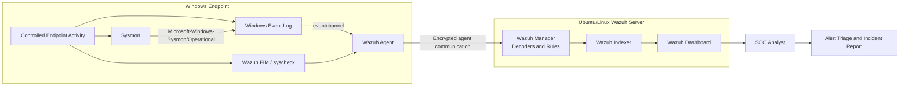

# Mermaid Architecture Diagram

```mermaid
flowchart LR
    subgraph Endpoint["Windows Endpoint"]
        Activity["Controlled Endpoint Activity"]
        Sysmon["Sysmon"]
        WinLog["Windows Event Log"]
        FIM["Wazuh FIM / syscheck"]
        Agent["Wazuh Agent"]

        Activity --> Sysmon
        Activity --> WinLog
        Activity --> FIM
        Sysmon -->|"Microsoft-Windows-Sysmon/Operational"| WinLog
        WinLog -->|"eventchannel"| Agent
        FIM --> Agent
    end

    subgraph Server["Ubuntu/Linux Wazuh Server"]
        Manager["Wazuh Manager<br/>Decoders and Rules"]
        Indexer["Wazuh Indexer"]
        Dashboard["Wazuh Dashboard"]
    end

    Agent -->|"Encrypted agent communication"| Manager
    Manager --> Indexer
    Indexer --> Dashboard
    Dashboard --> Analyst["SOC Analyst"]
    Analyst --> Report["Alert Triage and Incident Report"]
```

The diagram separates Sysmon telemetry from Wazuh FIM integrity monitoring while showing how both reach the same investigation workflow.

