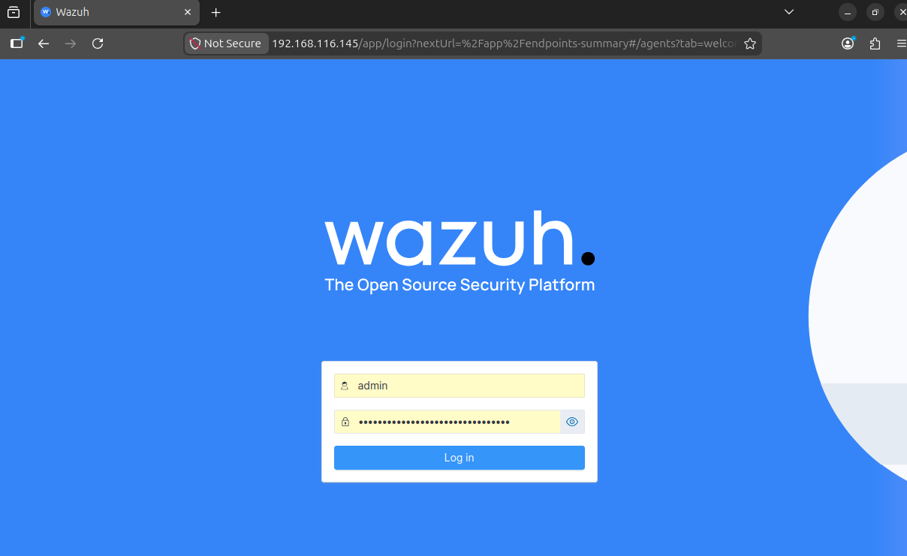
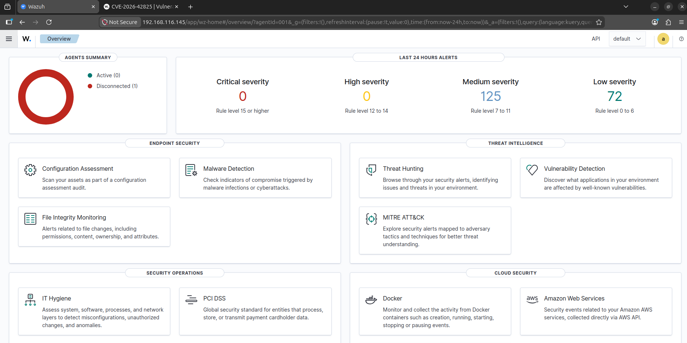

# Phase 01 - Wazuh Dashboard Setup

## Objective

Deploy the Wazuh central components on an Ubuntu/Linux server and verify access to the Wazuh Dashboard.

## Why this matters in SOC work

The Wazuh manager, indexer, and Dashboard form the central analysis platform. Endpoint telemetry is useful only when the SOC can receive, search, correlate, and investigate it reliably.

## Prerequisites

- Supported Ubuntu/Linux server
- Administrative shell access
- Internet access for package retrieval
- Adequate CPU, memory, and storage for the selected deployment
- Browser access from the analyst workstation

## Commands used

Review the current official Wazuh installation guide before deployment. For an all-in-one lab installation:

```bash
curl -sO https://packages.wazuh.com/4.x/wazuh-install.sh
sudo bash ./wazuh-install.sh -a
```

Verify services:

```bash
sudo systemctl status wazuh-manager
sudo systemctl status wazuh-indexer
sudo systemctl status wazuh-dashboard
```

Access the interface:

```text
https://<WAZUH_DASHBOARD_ADDRESS>
```

Store generated credentials in a password manager. Do not commit them to Git.

## Expected result

- Wazuh manager, indexer, and Dashboard services are active.
- The Dashboard login page is reachable.
- An authorized administrator can sign in.
- The Dashboard loads without service or index errors.

## Evidence to capture





Capture service status and the Dashboard home page. The values shown in this repository belong to the isolated simulation environment.

## Troubleshooting

```bash
sudo journalctl -u wazuh-manager -n 100 --no-pager
sudo journalctl -u wazuh-indexer -n 100 --no-pager
sudo journalctl -u wazuh-dashboard -n 100 --no-pager
sudo ss -lntp
```

- Confirm host resources meet Wazuh requirements.
- Check DNS, time synchronization, firewall rules, and service dependencies.
- If a browser reports a certificate warning in the isolated lab, verify the expected certificate fingerprint before proceeding.

## Completion criteria

Phase 01 passes when all central services are running and the analyst can access the Dashboard.
