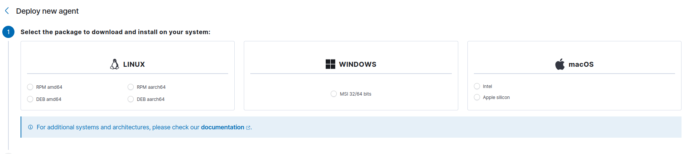
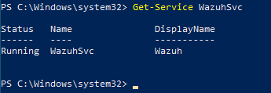
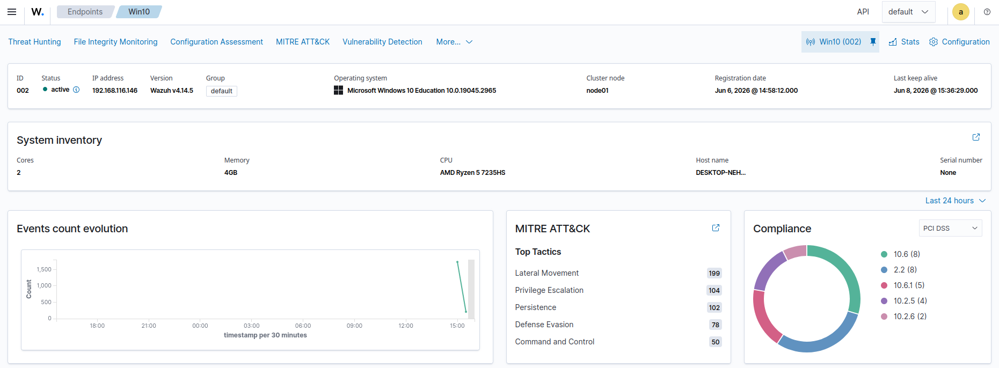

# Phase 02 - Windows Wazuh Agent

## Objective

Install a Wazuh agent on a Windows endpoint and confirm that it connects to the Wazuh manager.

## Why this matters in SOC work

The endpoint agent is the collection and control point for Windows logs, Sysmon telemetry, FIM events, inventory, and agent health. Connectivity must be validated before detection testing.

## Prerequisites

- Completed Phase 01
- Windows 10 or Windows 11 test endpoint
- PowerShell as Administrator
- Network reachability to `<WAZUH_MANAGER_IP>`
- Authorized Wazuh enrollment method

## Commands used

Use the current agent deployment command generated by:

```text
Wazuh Dashboard -> Agents management -> Summary -> Deploy new agent
```

Safe command pattern:

```powershell
Invoke-WebRequest `
  -Uri "https://packages.wazuh.com/4.x/windows/wazuh-agent-<VERSION>.msi" `
  -OutFile "$env:TEMP\wazuh-agent.msi"

msiexec.exe /i "$env:TEMP\wazuh-agent.msi" /q `
  WAZUH_MANAGER="<WAZUH_MANAGER_IP>" `
  WAZUH_AGENT_NAME="<WINDOWS_AGENT_NAME>"

Start-Service WazuhSvc
```

Verify the service:

```powershell
Get-Service WazuhSvc
```

Review recent agent logs:

```powershell
Get-Content "C:\Program Files (x86)\ossec-agent\ossec.log" -Tail 100
```

## Expected result

- `WazuhSvc` reports `Running`.
- The endpoint appears in the Dashboard with status `Active`.
- The agent log shows successful manager communication and no persistent configuration errors.

## Evidence to capture







The addresses and endpoint identifiers shown in the evidence belong to the isolated simulation environment.

## Troubleshooting

```powershell
Restart-Service WazuhSvc
Test-NetConnection -ComputerName "<WAZUH_MANAGER_IP>" -Port 1514
Select-String `
  -Path "C:\Program Files (x86)\ossec-agent\ossec.log" `
  -Pattern "ERROR|WARN|connected|disconnected"
```

- Verify the manager address and agent name.
- Confirm endpoint and server clocks are synchronized.
- Check Windows and network firewalls.
- Confirm the endpoint was enrolled using an authorized method.

## Completion criteria

Phase 02 passes when the Windows service is running and the Dashboard reports the agent as active.
