# Phase 04 - Detection Validation

## Objective

This phase validates that security activity on the Windows endpoint is generated, collected, and available for investigation in Wazuh.

The validation uses five test cases:

| Test case | Detection scenario |
|---|---|
| TC01 | Windows Account Manipulation |
| TC02 | Suspicious PowerShell Execution |
| TC03 | Scheduled Task Persistence |
| TC04 | File Integrity Monitoring Lifecycle |
| TC05 | Microsoft Defender Tamper Simulation |

> Run the test commands from PowerShell as Administrator. This is a controlled lab. Review each cleanup command before running it.

## Evidence terminology

The following terms describe different stages of the detection pipeline:

| Term | Meaning |
|---|---|
| Event generated | Windows or Sysmon recorded the endpoint activity. |
| Event collected | The Wazuh agent forwarded the event and it became searchable in Wazuh. |
| Alert generated | A Wazuh rule matched the collected event and created an alert. |
| Custom detection generated | A lab-specific custom Wazuh rule matched the activity. |

A raw Sysmon event proves telemetry generation and collection, but it must not be described as a custom detection alert unless a custom rule actually matched it.

## TC01 - Windows Account Manipulation

### Objective

Create a local Windows account named `soc_lab_user` and verify that Windows Security Event ID `4720` is collected by Wazuh.

### Security significance

Attackers may create local accounts to establish an additional access path or maintain persistence on a compromised endpoint. Local account creation should therefore be visible to the SOC.

### Test command

```powershell
net user soc_lab_user "P@ssw0rd123!" /add
```

### Expected telemetry

| Field | Expected value |
|---|---|
| Data source | Windows Security Event Log |
| Collector | Wazuh Windows agent |
| Event ID | `4720` |
| Target account | `soc_lab_user` |

A local group membership change would normally be associated with Security Event ID `4732`. That action is not treated as screenshot-backed evidence in this test case.

### Evidence and screenshot explanation

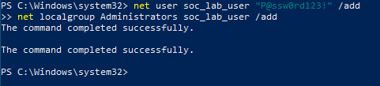

This screenshot shows the command used to create the local account `soc_lab_user`.

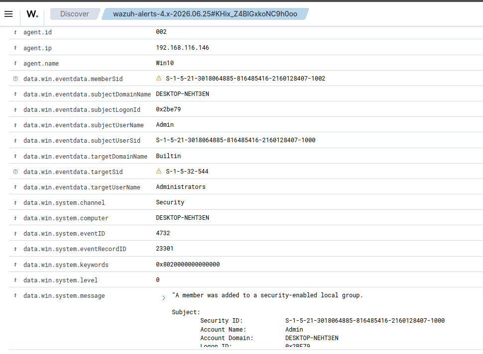

This screenshot shows Windows Security Event ID `4720`, confirming that the local account creation event was generated and collected for investigation.

### Detection result

**Pass** - Local account creation was detected and collected by Wazuh.

### MITRE ATT&CK mapping

- `T1136.001` - Create Account: Local Account

### Cleanup command

```powershell
net user soc_lab_user /delete
```

### Conclusion

The endpoint generated the expected account creation audit event, and Wazuh collected the evidence required to investigate the activity.

## TC02 - Suspicious PowerShell Execution

### Objective

Execute PowerShell with `-NoProfile` and `-ExecutionPolicy Bypass`, write a marker into `C:\Users\Public\SOC-Lab`, and validate the resulting Sysmon and Wazuh evidence.

### Security significance

PowerShell is a legitimate administration tool that is frequently abused for execution, payload staging, and defense evasion. Full process command-line telemetry helps analysts distinguish normal administration from suspicious use.

### Test command

```powershell
powershell.exe -NoProfile -ExecutionPolicy Bypass -Command "New-Item -ItemType Directory -Force 'C:\Users\Public\SOC-Lab' | Out-Null; Set-Content -Path 'C:\Users\Public\SOC-Lab\powershell-proof.txt' -Value 'SOC-LAB PowerShell test'"
```

### Expected telemetry

| Field | Expected value |
|---|---|
| Primary data source | Sysmon |
| Primary event | Sysmon Event ID `1` - Process Create |
| Image | `powershell.exe` |
| Command line | Contains `-ExecutionPolicy Bypass` |
| User | `DESKTOP-NEHT3EN\Admin` |
| Integrity level | `High` |
| Parent image | `powershell.exe` |
| Wazuh rule | `92027` - PowerShell process spawned PowerShell instance |
| Wazuh rule | `92213` - Executable file dropped in folder commonly used by malware |

Rule `92213` in this test is primarily associated with a temporary `_PSScriptPolicyTest_*.ps1` file. The primary evidence for the suspicious command line is Sysmon Event ID `1`.

### Evidence and screenshot explanation

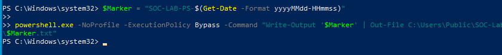

This screenshot shows the PowerShell test command using `-NoProfile` and `-ExecutionPolicy Bypass`.

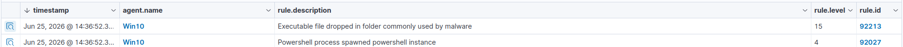

This screenshot shows Wazuh alerts associated with the PowerShell execution, including rules `92027` and `92213`.

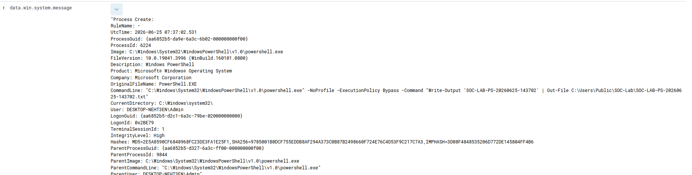

This screenshot shows a Sysmon Process Create event for `powershell.exe`. The command line includes `-ExecutionPolicy Bypass`, and the event also records the user, parent process, process GUID, process ID, hash values, and integrity level.

### Detection result

**Pass** - The suspicious PowerShell process telemetry was collected, and related Wazuh rules generated alerts.

### MITRE ATT&CK mapping

- `T1059.001` - Command and Scripting Interpreter: PowerShell

### Cleanup command

```powershell
Remove-Item "C:\Users\Public\SOC-Lab\powershell-proof.txt" -Force -ErrorAction SilentlyContinue
```

### Conclusion

Sysmon captured the PowerShell process and command line, while Wazuh made the event and related rule matches available for analyst investigation.

## TC03 - Scheduled Task Persistence

### Objective

Create a scheduled task named `SOC-Lab-Heartbeat` and verify that its Task Scheduler telemetry is collected by Wazuh.

### Security significance

Scheduled tasks can execute programs automatically and are commonly abused to establish persistence. The task name, author, action, arguments, and XML definition are valuable investigation fields.

### Test command

```powershell
New-Item -ItemType Directory -Force "C:\Users\Public\SOC-Lab" | Out-Null
schtasks /Create /TN "SOC-Lab-Heartbeat" /SC ONCE /ST 23:59 /TR "cmd.exe /c echo SOC-LAB > C:\Users\Public\SOC-Lab\task-proof.txt" /F
```

### Expected telemetry

| Field | Expected value |
|---|---|
| Data source | `Microsoft-Windows-TaskScheduler/Operational` |
| Collector | Wazuh Windows agent |
| Task name | `\SOC-Lab-Heartbeat` |
| Author | `DESKTOP-NEHT3EN\Admin` |
| Command | `cmd.exe` |
| Arguments | Contains the command that writes `task-proof.txt` |
| Additional evidence | Task XML collected by Wazuh |

This validation does not claim Security Event ID `4698` because the available screenshot does not clearly establish that field.

### Evidence and screenshot explanation

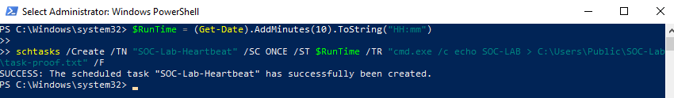

This screenshot shows the `schtasks` command used to create the `SOC-Lab-Heartbeat` task.

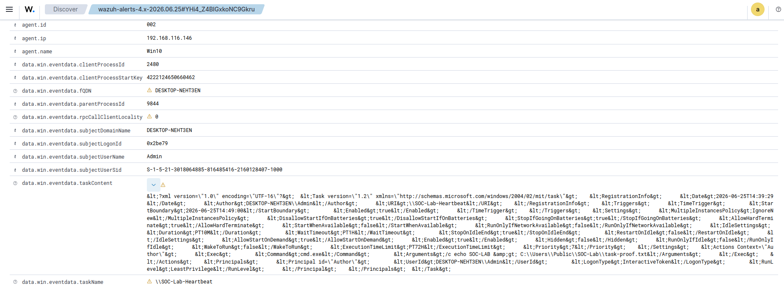

This screenshot shows the Task Scheduler event collected by Wazuh, including the task name, author, command, arguments, and task XML.

### Detection result

**Pass** - Scheduled task telemetry was generated and collected by Wazuh.

### MITRE ATT&CK mapping

- `T1053.005` - Scheduled Task/Job: Scheduled Task

### Cleanup command

```powershell
schtasks /Delete /TN "SOC-Lab-Heartbeat" /F
Remove-Item "C:\Users\Public\SOC-Lab\task-proof.txt" -Force -ErrorAction SilentlyContinue
```

### Conclusion

Wazuh collected the scheduled task definition and its execution details, providing the evidence needed to investigate this persistence technique.

## TC04 - File Integrity Monitoring Lifecycle

### Objective

Create, modify, and delete a file in `C:\Users\Public\SOC-Lab`, then verify that Wazuh FIM records the complete file lifecycle.

### Security significance

Unexpected file creation, modification, or deletion may indicate payload delivery, configuration tampering, log destruction, or persistence. FIM provides change visibility for sensitive paths.

### Test command

```powershell
New-Item -ItemType Directory -Force "C:\Users\Public\SOC-Lab" | Out-Null
$testFile = "C:\Users\Public\SOC-Lab\fim-lifecycle-proof.txt"

Set-Content -Path $testFile -Value "SOC-LAB created"
Start-Sleep -Seconds 5

Add-Content -Path $testFile -Value "SOC-LAB modified"
Start-Sleep -Seconds 5

Remove-Item -Path $testFile -Force
```

### Expected telemetry

| Wazuh rule | Level | Expected event |
|---|---:|---|
| `554` | 5 | File added to the system |
| `550` | 7 | Integrity checksum changed |
| `553` | 7 | File deleted |

The investigation should expose fields such as:

- `syscheck.path`
- `syscheck.event`
- `rule.id`
- `rule.level`
- `agent.name`
- `full_log`

The monitored folder operates in `realtime` mode.

### Evidence and screenshot explanation

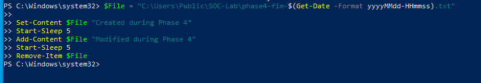

This screenshot shows the commands that create, modify, and delete the test file.

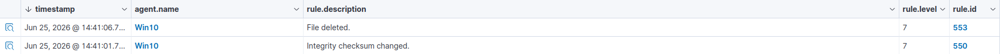

This screenshot summarizes the Wazuh FIM alerts generated across the file lifecycle.

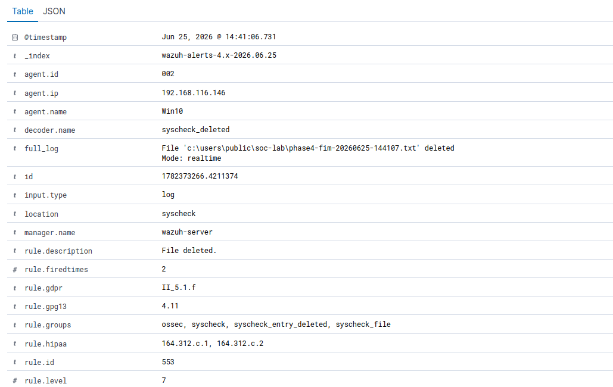

This screenshot shows detailed evidence for the file deletion event, including the monitored path and associated Wazuh rule.

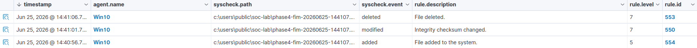

This screenshot shows the complete sequence of file added, checksum changed, and file deleted events.

### Detection result

**Pass** - Complete FIM lifecycle detected through Wazuh rules `554`, `550`, and `553`.

### MITRE ATT&CK mapping

FIM is a detection control that can support multiple ATT&CK techniques depending on the file path and activity. This controlled lifecycle test validates telemetry coverage rather than assigning one unsupported adversary technique.

### Cleanup command

```powershell
Remove-Item "C:\Users\Public\SOC-Lab\fim-lifecycle-proof.txt" -Force -ErrorAction SilentlyContinue
```

### Conclusion

Wazuh FIM detected all three lifecycle stages in real time and exposed the rule and file metadata required for investigation.

## TC05 - Microsoft Defender Tamper Simulation

### Objective

Safely simulate a command line associated with disabling Microsoft Defender real-time monitoring and verify that Sysmon records the process telemetry.

### Security significance

Attempts to disable or modify security tools can indicate defense evasion. Command-line visibility allows analysts to identify the intent of a process even when the simulated command does not change the security product.

### Test command

```powershell
powershell.exe -NoProfile -Command "Write-Output 'SOC-LAB simulation: Set-MpPreference -DisableRealtimeMonitoring true'"
```

This is a safe simulation. It prints a string and does not execute `Set-MpPreference` or disable Microsoft Defender.

### Expected telemetry

| Field | Expected value |
|---|---|
| Data source | Sysmon Event ID `1` |
| Collector | Wazuh Windows agent |
| Image | `powershell.exe` |
| Command line | Contains `Set-MpPreference` |
| Command line | Contains `DisableRealtimeMonitoring` |
| User | `DESKTOP-NEHT3EN\Admin` |
| Integrity level | `High` |
| Process context | Includes parent image, parent command line, process ID, and process GUID |

The expected result is telemetry collection. This test does not claim that Defender was disabled or that a custom Wazuh detection rule generated an alert.

### Evidence and screenshot explanation

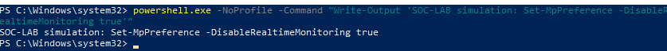

This screenshot shows the safe PowerShell simulation command. The Defender-related text is passed to `Write-Output` and is not executed as a configuration change.

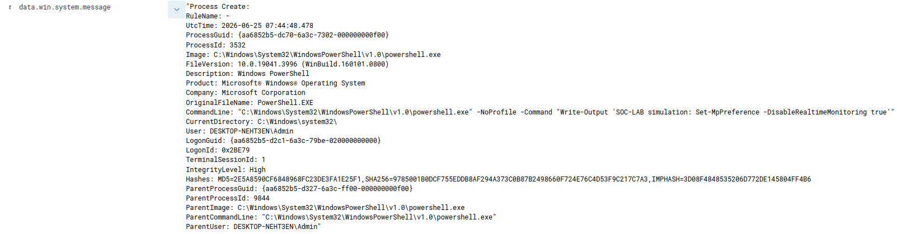

This screenshot shows the Sysmon Process Create event collected for the simulation. The command line contains `Set-MpPreference` and `DisableRealtimeMonitoring`, along with process, user, parent process, and integrity metadata.

### Detection result

**Pass - Telemetry collection** - Sysmon generated the process event and the Wazuh agent collected it. No custom detection alert is claimed.

### MITRE ATT&CK mapping

- `T1562.001` - Impair Defenses: Disable or Modify Tools

### Cleanup command

```powershell
# No cleanup is required because the command only printed a simulation string.
```

### Conclusion

The test confirms command-line telemetry for a simulated Defender tamper attempt. Microsoft Defender remained enabled, and the result demonstrates collection rather than a custom Wazuh detection.

## Validation summary

| Test case | Detection | Primary evidence | Status |
|---|---|---|---|
| TC01 | Local account creation | Security Event ID `4720` | Pass |
| TC02 | Suspicious PowerShell execution | Sysmon Event ID `1` and Wazuh rules `92027`/`92213` | Pass |
| TC03 | Scheduled task persistence | TaskScheduler Operational event collected by Wazuh | Pass |
| TC04 | FIM file lifecycle | Wazuh FIM rules `554`/`550`/`553` | Pass |
| TC05 | Defender tamper simulation telemetry | Sysmon Event ID `1` command line | Pass - Telemetry |

## Final Data Flow

```text
Windows activity
    -> Windows Security / Sysmon / TaskScheduler / FIM
    -> Wazuh Agent
    -> Wazuh Manager rules and decoders
    -> Wazuh Indexer
    -> Wazuh Dashboard
    -> Analyst investigation
```

Phase 04 demonstrates the endpoint-to-dashboard ingest and investigation chain. Windows and Sysmon generate the source telemetry, the Wazuh agent collects it, the Wazuh platform decodes and indexes it, and analysts validate the resulting events or alerts in the dashboard.
